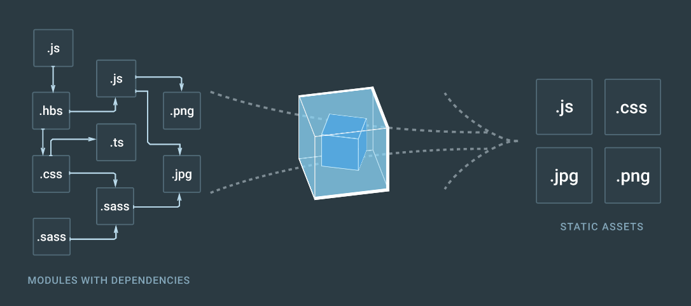

Webpack 是一个模块打包器，处理带有依赖关系的模块，生成一系列代表这些模块的静态资源。



# 特性
- [MOTIVATION](http://webpack.github.io/docs/motivation.html)
- [AMD](https://github.com/amdjs/amdjs-api/wiki/AMD-(%E4%B8%AD%E6%96%87%E7%89%88))
- [CommonJS](http://javascript.ruanyifeng.com/nodejs/module.html)
- [ES6 Module](http://es6.ruanyifeng.com/#docs/module)

## 支持多种模块化方案
随着单页应用变得越来越复杂，前端有越来越多的 JS，而现有的模块打包器已经不适合大项目。最为迫切的是，我们需要一个可以把代码进行拆分，将静态资源无缝接入模块化的打包器。

现有的模块依赖定义和模块输出方案如下所示：

- script：直接在全局命名空间定义变量来输出模块，存在很大局限性

  - 全局变量冲突
  - 加载顺序要求很严格
  - 开发者需要手动处理依赖
  - 大型项目模块列表会变得很长且难以维护

- CommonJS：通过同步 require 方法加载依赖并返回一个导出的接口

  优点

  - 服务端的模块可重用
  - 已经有很多模块用这种风格 比如 npm 包
  - 非常简单易用
  
  缺点

  - 网络请求是异步的，所以在网络请求上阻塞执行的不是很好
  - 不能并行加载多个模块

  实现

  - node.js - server-side
  - browserify
  - modules-webmake - compile to one bundle
  - wreq - client-side

- AMD：通过异步 require 方法加载依赖

  优点

  - 满足网络异步请求
  - 可以并行加载多个依赖

  缺点

  - 更难阅读和编写代码
  - 看起来像某种变通方案 

  实现

  - RequireJS

- ES6 modules

  优点

  - 容易实现静态分析
  - 符合未来的 ES 标准

  缺点

  - 浏览器支持还需要一些时间

Webpack 本身是个模块打包器，并没有提出新的模块化方案。但是， Webpack 可以支持目前已有的模块化方案：CommonJS，AMD 和 ES Module。

## 每个静态资源都是一个模块
前端静态资源不仅仅是 JavaScript，还有很多其他资源（如 CSS）也是模块，也可以进行模块打包和划分。

## 支持代码划分
如果没有代码划分，客户端要么直接加载一个包含了所有模块的文件，要么每个模块发起一次请求，这对于客户端资源加载来说，都是最差的选择。然而，Webpack 却可以根据不同的维度将所有的依赖模块，划分成多个静态资源块，从而实现代码划分和按需加载，优化客户端资源加载效率。

## 完善的开发工具
- 提供了开发服务器，可以实现模块热加载，带来非常爽的开发体验。
- 提供了模块打包构建分析工具，帮助我们分析应用程序的模块依赖关系。
- ...

# 对比
[Comparison with other bundlers](https://webpack.js.org/guides/comparison/)

- RequireJS
- Browserify
- Rollup 

# 概念
Webpack 是为现代 JavaScript 应用程序提供的模块构建器，在使用 Webpack 的过程中必须先了解其中的四个概念。更多详情参考 [Concepts](https://webpack.js.org/concepts/)。

- 入口

    Webpack 为你的应用程序的构建了一张模块依赖关系图，这个图的起点就是应用程序的入口模块，这个入口告诉 Webpack 应用程序是从哪里启动的。所以，要使用 Webpack 必须提供应用程序的入口模块。
    
    在 Webpack 配置文件的 entry 属性里，可以配置应用程序的入口信息。例如：

    ```
    // webpack.config.js
    module.exports = {
      entry: './path/to/my/entry/file.js'
    };
    ```

- 出口

    Webpack 将所有的模块打包合并后需要生成一个打包文件，我们需要告诉 Webpack 在哪里放置这个打包文件以及文件命名方式，这正是输出配置需要处理的事情。

    Webpack 配置文件的 output 属性描述了打包文件的输出信息，例如：

    ```
    var path = require('path');
    module.exports = {
      entry: './path/to/my/entry/file.js',
      output: {
        path: path.resolve(__dirname, 'dist'),
        filename: 'my-first-webpack.bundle.js'
      }
    };
    ```

- 加载器

    Webpack 支持将所有静态资源进行模块化处理，然而默认情况下 Webpack 只能识别 JavaScript。加载器可以帮助我们转换这些非 JavaScript 代码文件，添加到依赖关系图中。

    一般配置文件必须告诉 Webpack 哪些模块是需要使用哪些加载器，例如：

    ```
    var path = require('path');
    const config = {
      entry: './path/to/my/entry/file.js',
      output: {
        path: path.resolve(__dirname, 'dist'),
        filename: 'my-first-webpack.bundle.js'
      },
      module: {
        rules: [
          {test: /\.(js|jsx)$/, use: 'babel-loader'} // js 和 jsx 后缀的模块使用 babel 加载
        ]
      }
    };
    ```

- 插件

    加载器是用于转换非 JavaScript 模块的，不能在整体模块层面对模块进行优化处理，例如：对打包文件进行压缩。而插件却可以对所有打包模块统一处理，或者在编译时期注入一些特殊的处理逻辑。

    Webpack 约定插件是个函数，在配置中添加插件时需要引入相应的插件，然后新增相应插件的实例到配置属性 plugins 中，例如：

    ```
    const HtmlWebpackPlugin = require('html-webpack-plugin'); //installed via npm
    const webpack = require('webpack'); //to access built-in plugins
    const path = require('path');
    
    const config = {
      entry: './path/to/my/entry/file.js',
      output: {
        path: path.resolve(__dirname, 'dist'),
        filename: 'my-first-webpack.bundle.js'
      },
      module: {
        rules: [
          {test: /\.(js|jsx)$/, use: 'babel-loader'}
        ]
      },
      plugins: [
        new webpack.optimize.UglifyJsPlugin(), // 代码压缩插件
        new HtmlWebpackPlugin({template: './src/index.html'}) // HTML 生成插件，生成的 HTML 里引用了打包后的静态资源
      ]
    };
    
    module.exports = config;
    ```
